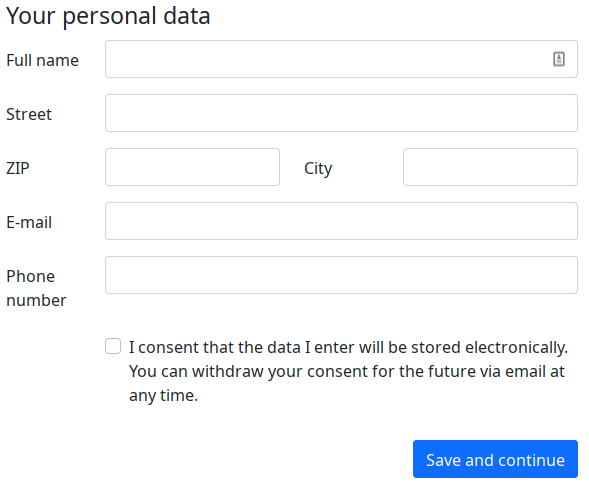

==================================
TYPO3 extension ``onetimeaccount``
==================================

:Extension key:
   onetimeaccount

:Package name:
   oliverklee/onetimeaccount

:Version:
   |release|

:Language:
   en

:Author:
   Oliver Klee

:License:
   This extension is published under the
   `GNU General Public License v2.0 <https://www.gnu.org/licenses/old-licenses/gpl-2.0.html>`__.

:Rendered:
   |today|

This extension provides a Bootstrap-5-compatible form that allows users to
create a one-time FE account to which they will be automatically logged in
(without having to enter a username or password).

It is often used together with the
`seminars extension <https://extensions.typo3.org/extension/seminars>`__,
allowing attendees to sign up for events without having to create an account.

The content of this document is related to TYPO3 - a GNU/GPL CMS/Framework available from www.typo3.org

**Table of Contents:**

.. toctree::
   :maxdepth: 2
   :titlesonly:

   WhatDoesItDo
   Installation
   Upgrading

.. Meta Menu
