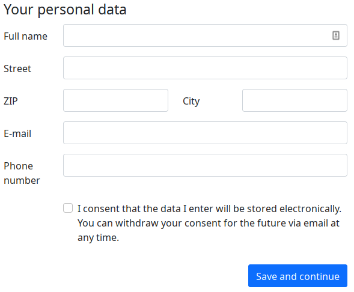

# "One time account" TYPO3 extension

This extension provides a Bootstrap-5-compatible form that allows users to
create a short-lived FE user account without having to enter a user name or
password.

It also provides a CAPTCHA.

|                  | URL                                                            |
|------------------|----------------------------------------------------------------|
| **Repository:**  | https://github.com/oliverklee/ext-onetimeaccount               |
| **Read online:** | https://docs.typo3.org/p/oliverklee/onetimeaccount/main/en-us/ |
| **TER:**         | https://extensions.typo3.org/extension/onetimeaccount/         |

## Give it a try!

If you would like to test the extension yourself, there is a
[DDEV-based TYPO3 distribution](https://github.com/oliverklee/TYPO3-testing-distribution)
with this extension installed and some test records ready to go.
